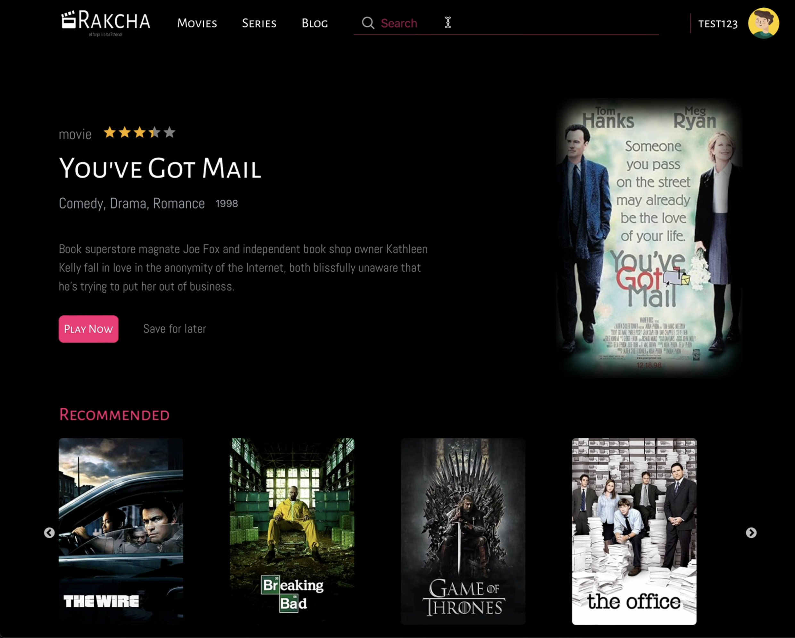
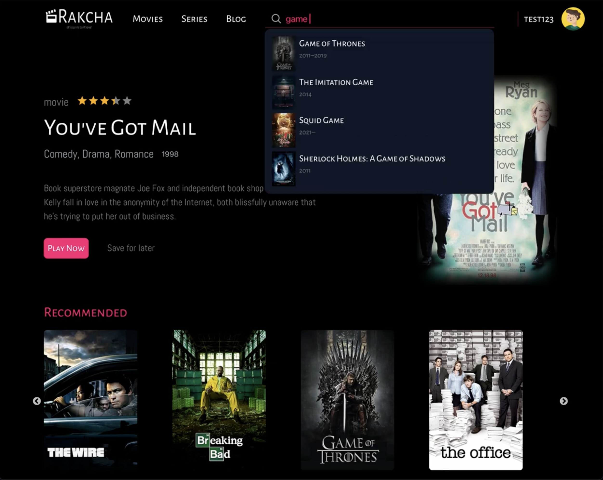
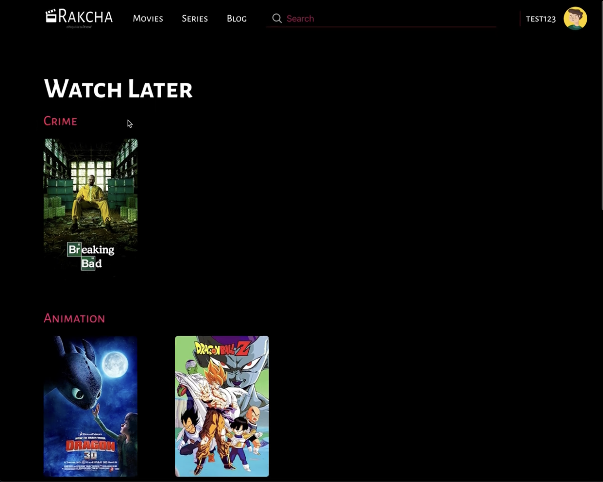

# Rakcha tn

## Description

This web platform provides users with access to a vast library of movies and TV series, allowing them to stream content on-demand. With a user-friendly interface and a wide range of features, users can enjoy their favorite titles anytime, anywhere. But most importantly, no ads!

## Features

- **User Authentication**: Create accounts, sign in, and manage profiles.
- **Content Library**: Explore a diverse collection of movies and series across genres and languages.
- **Search and Filtering**: Easily find content by title.
- **Streaming Player**: High-quality video playback with adjustable resolution and subtitles.
- **Watchlists**: Bookmark favorite titles for later viewing.
- **Favoritelists**: Save your favorite shows.
- **Social Integration**: Engage with the community through comments and interactions.
- **Responsive Design**: Accessible across devices with a responsive layout.
- **Content Licensing**: Compliance with content licensing agreements and regional availability.

## Screenshots

### Home Screen

### Search Example

### Sign Up Page

### Watch Later Page

### Watching Page

### Comments Section

## Usage

To use the platform, simply sign up for an account and start browsing the library of movies and series. Use the search and filtering options to find specific titles or explore recommendations. Once you've found something to watch, simply click play and enjoy streaming.
